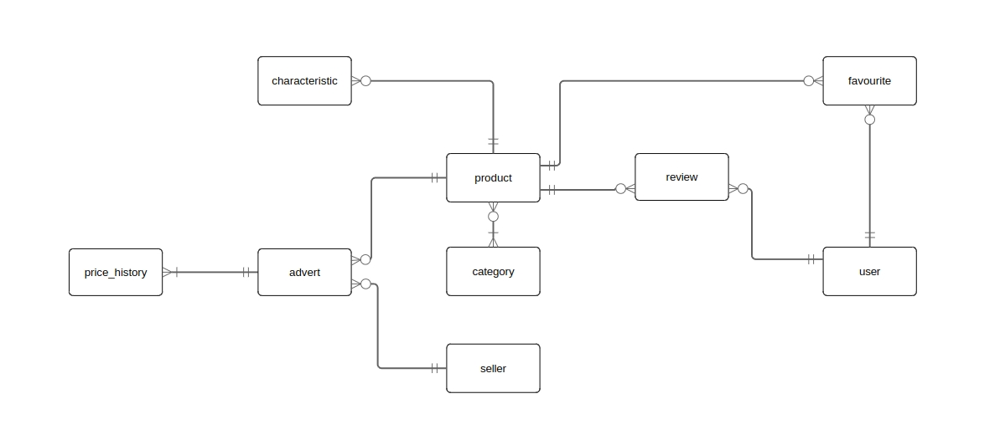
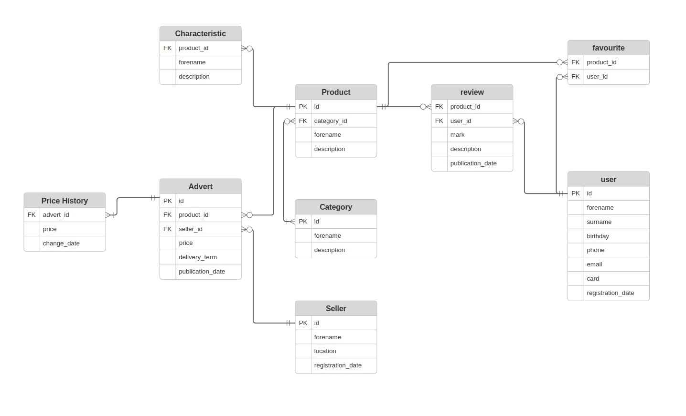
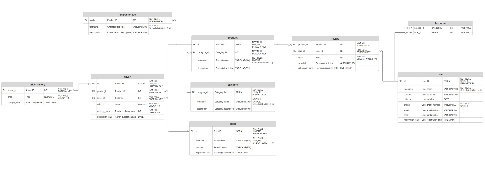

# Сервис хранения и модифицирования информации об объявлениях на маркееплейсе

---
## Общая информация
### Модель базы данных для сайтов-маркетплейсов, таких, как Яндекс.Маркет, OZON

---
### Основные таблицы. Все находится в схеме `marketplace`
#### Таблица категорий товаров `category`
- Хранит уникальный ID категории, имя категории и описание категории
#### Таблица товаров `product`
- Хранит уникальный ID товара, ID категории, к которой относится (например, `Еда` или `Мебель`) и имя товара
#### Таблица характеристик товаров `characteristic`
- Хранит ID товара, тип характеристики и тип товара по этой характеристике (например, `Диагонаь экрана -- 5'`)
#### Таблица продавцов `seller`
- Хранит уникальный ID продавца, имя продавца, его местоположение и дату его регистрации
#### Таблица объявлений `advert`
- Хранит уникальный ID объявления, ID товара, ID продавца, дату публикации и срок доставки
#### Таблица истории цен `price_history`
- Хранит ID объявления, выставленную цену и дату ее выставления
#### Таблица пользователей `customer`
- Хранит уникальный ID пользователя, имя, фамилию, дату рождения, телефон, 
адрес электронной почты, номер банковской карты и дату регистрации
#### Таблица оценок товаров `product_review`
- Хранит ID товара, ID пользователя - автора отзыва, выставленную оценку, текст отзыва и дату публикации
#### Таблица избранных товаров `favourite`
- Хранит ID товара и ID пользователя, которые этот товар добавил в избранные

### Концептуальная модель


### Логическая модель


### Физическая модель


## Запуск
### Тестирование
Тестирование происходит при помощи `pytest`. Все файлы находятся в папке `tests`
1. `data` - папка с тестовыми данными для таблиц
2. `output` - папка с корректными выводами на тесты от базы данных
3. `requests` - папка с тестами (запросами)
4. `export.sql` - скрипт для полного экспорта базы данных в файлы `csv`
5. `fill.sql` - скрипт для заполнения таблиц базы данных случайными данными
6. `import.sql` - скрипт для импорта таблиц базы данных из файлов `csv`

#### Для запуска тестирования выполнить:
```bash
pytest tests/test_db.py
```

### Рабочий режим
#### Выполнить файлы в следующем порядке:
1. `init.sql` - инициализация баз данных
2. `function/random.sql` - создание вспомогательных функций, генерирующих случайные данные
3. `function/partial.sql` - создание вспомогательных функций, скрывающих данные пользователя
4. `function/trigger.sql` - создание вспомогательных функций для триггеров
5. `view.sql` - инициализация представлений
6. `index.sql` - инициализация индексов
7. `trigger.sql` - инициализация триггеров

Для полного удаления запустить `drop.sql`

---
### ***By NThemeDEV***
